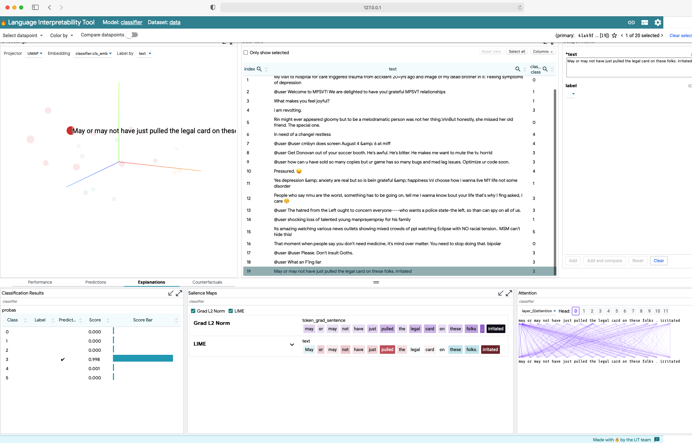

# 🔥 `classifier-lit` The Language Interpretability Tool (LIT) for Text Classification



This is an implementation of the
[PAIR-code Language Interpretability Tool](https://pair-code.github.io/lit/) for text classification.
This was assembled from examples as a way to
experiment with various features of LIT. See the [LIT User's Guide](https://github.com/PAIR-code/lit/blob/main/documentation/user_guide.md)
for more information.

## Quickstart
Install the requirements,
```
pip install -r requirements
```
run the (`bash`) script
```bash
./run_demo.sh
```
The required `pytorch` model files will be downloaded if they are not cached
```
starting LIT server, model bhadresh-savani/distilbert-base-uncased-emotion
I0925 13:49:29.168361 8637451776 seq_model.py:86] DistilBertForSequenceClassification loaded for 6 labels
I0925 13:49:29.175712 8637451776 seq_dataset.py:62]          rows:   20
I0925 13:49:29.180124 8637451776 seq_dataset.py:63] unique labels:    3
I0925 13:49:29.181498 8637451776 dev_server.py:88]
 (    (
 )\ ) )\ )  *   )
(()/((()/(` )  /(
 /(_))/(_))( )(_))
(_)) (_)) (_(_())
| |  |_ _||_   _|
| |__ | |   | |
|____|___|  |_|


I0925 13:49:29.181543 8637451776 dev_server.py:89] Starting LIT server...
I0925 13:49:29.181587 8637451776 caching.py:124] CachingModelWrapper 'classifier': no cache path specified, not loading.
I0925 13:49:29.182018 8637451776 gradient_maps.py:120] Skipping token_grad_sentence since embeddings field not found.
I0925 13:49:29.182076 8637451776 gradient_maps.py:235] Skipping token_grad_sentence since embeddings field not found.
I0925 13:49:29.182271 8637451776 wsgi_serving.py:41]

Starting Server on port 5432
You can navigate to 127.0.0.1:5432


I0925 13:49:29.183076 8637451776 _internal.py:225]  * Running on http://127.0.0.1:5432/ (Press CTRL+C to quit)
```

Paste `127.0.0.1:5432` into your browser. 

## Model
A model name or path for a `transformers` SequenceClassification model. 
This can be a path to your (`pytorch`) trained model or the name an appropriate
model from [HuggingFace models](https://huggingface.co/models).

## Data
The data is a `.csv`,  ideally consisting of validation data, with one column
for the text and the other validation label. 

If the validation label is not known, use 0 (zero). 
The metrics will be meaningless, but all the other LIT features are
available.


## Using a GPU
A GPU is automatically detected and used.
If your GPU instance is a remote, headless cloud instance, you can still
use your local browser by using port forwarding feature of SSH. For 
the default port 5432:

```
ssh -i access-creds.pem -L 5432:localhost:5432 <your id>@<remote IP address>
```

Start the server on the remote and then view the results in your local browser.

## Commandline Usage
```
usage: seq_server.py [-h] --model_path MODEL_PATH --data_path DATA_PATH
                     --label_text_cols LABEL_TEXT_COLS
                     [--batch_size BATCH_SIZE] [--max_seq_len MAX_SEQ_LEN]
                     [--port PORT]

Start the LIT server

optional arguments:
  -h, --help            show this help message and exit
  --model_path MODEL_PATH
                        tar.gz, name, or directory of the pytorch model
  --data_path DATA_PATH
                        path + file.csv, for the data .csv
  --label_text_cols LABEL_TEXT_COLS
                        python-style list of indexes [label-index, text-index]
                        in the .csv
  --batch_size BATCH_SIZE
                        batch size, default=8
  --max_seq_len MAX_SEQ_LEN
                        maximum sequence length up to 512, default=128
  --port PORT           LIT server port, default=5432
```

# License
MIT License Copyright &copy; 2021 Chris Skiscim

Permission is hereby granted, free of charge, to any person obtaining a copy
of this software and associated documentation files (the "Software"), to deal
in the Software without restriction, including without limitation the rights
to use, copy, modify, merge, publish, distribute, sublicense, and/or sell
copies of the Software, and to permit persons to whom the Software is
furnished to do so, subject to the following conditions:

The above copyright notice and this permission notice shall be included in all
copies or substantial portions of the Software.

THE SOFTWARE IS PROVIDED "AS IS", WITHOUT WARRANTY OF ANY KIND, EXPRESS OR
IMPLIED, INCLUDING BUT NOT LIMITED TO THE WARRANTIES OF MERCHANTABILITY,
FITNESS FOR A PARTICULAR PURPOSE AND NONINFRINGEMENT. IN NO EVENT SHALL THE
AUTHORS OR COPYRIGHT HOLDERS BE LIABLE FOR ANY CLAIM, DAMAGES OR OTHER
LIABILITY, WHETHER IN AN ACTION OF CONTRACT, TORT OR OTHERWISE, ARISING FROM,
OUT OF OR IN CONNECTION WITH THE SOFTWARE OR THE USE OR OTHER DEALINGS IN THE
SOFTWARE

lit-nlp is licensed under the Apache License Version 2.0